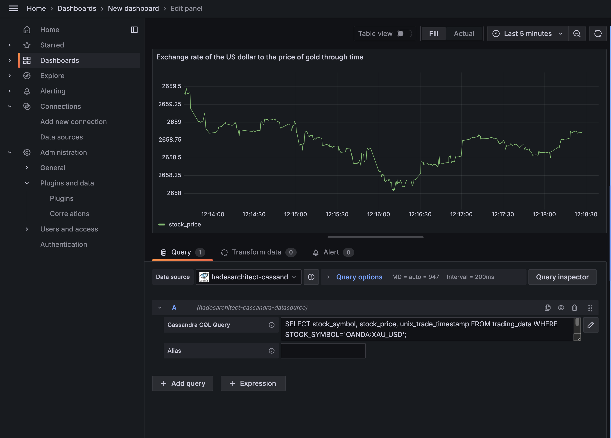
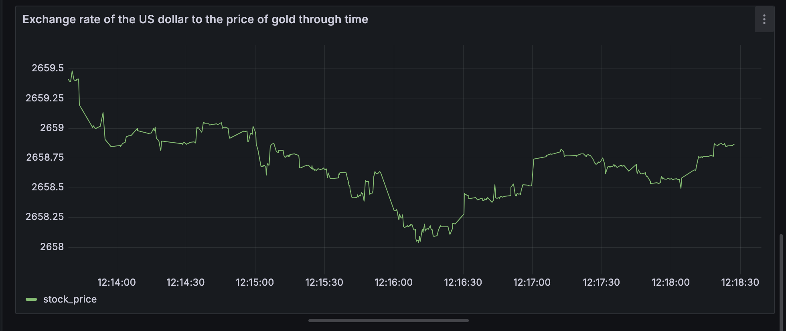
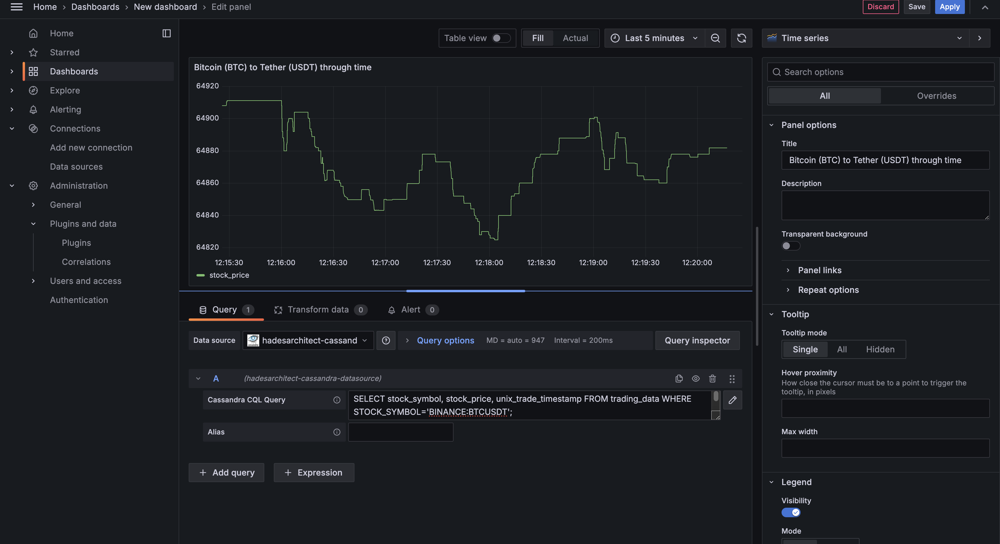
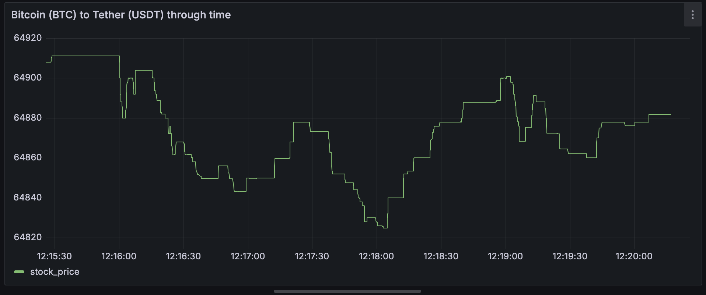

# 🚀 Finnhub Real-time Data Pipeline

The **Finnhub Real-time Data Pipeline** is a fully containerized solution for streaming, processing, and visualizing live trading data from [Finnhub.io](https://finnhub.io). It leverages websockets to collect real-time stock, forex, and crypto data, processes it using Apache Spark, and provides an interactive, live dashboard with Grafana for visualization.

---

## 📐 Architecture

### Key Components:
- **Data Source (Finnhub.io)**: 
  - Streams real-time trade data (stocks, forex, and crypto) through websockets.

- **Data Ingestion (Producer)**: 
  - A Python app (`producer`) connects to Finnhub.io, encodes messages in Avro format, and sends them to Kafka.

- **Message Broker (Kafka)**: 
  - Kafka, running in a Docker container, acts as the message broker for real-time data exchange.

- **Stream Processing (Spark)**: 
  - Spark cluster processes incoming messages with Spark Structured Streaming, transforms the data, and loads it into Cassandra.

- **Data Storage (Cassandra)**: 
  - Cassandra stores processed trade data in the right format for visualization.

- **Visualization (Grafana)**: 
  - Grafana, connected to Cassandra using Cassandra Plugin, visualizes the data on a dashboard that refreshes every 100ms.

---

## 📊 Real-time Dashboard 

Here is some images of the Dashboard :






---

## 🚀 Quick Start

### 1. Get an API Key
- Register at [Finnhub](https://finnhub.io) to generate your API key.

### 2. Configure Environment Variables
- Rename `env-default` to `.env`
- Edit the `.env` file with your API key and configurations

### 3. Launch the app with docker
- Use `docker compose up' to start the app

### 3. Create the Keyspace and table in Cassandra cluster
- Run the following command to start the cassandra job :

   ```bash
    make init-cassandra
    ```

### 4. Execute the Spark Job
- Submit the Spark job to process the incoming data:

    ```bash
    make spark-job
    ```

### 5. Access the Live Dashboard
- Open your browser and navigate to [localhost:3001](http://localhost:3001).
- Use `admin` as the username and password.
- Install the cassandra plugin in the app
- Connect the dashboard to the Cassandra source 
- Visualize the result


---

## 🛠 Tech Stack

- **Programming Language**: Python, Spark
- **Data Source**: Finnhub.io (via Websockets)
- **Data Ingestion**: Kafka, Avro format
- **Stream Processing**: Apache Spark (PySpark)
- **Data Storage**: Apache Cassandra
- **Visualization**: Grafana (with Cassandra plugin)
- **Containerization**: Docker, Docker Compose

